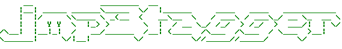
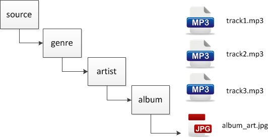

:source-highlighter: coderay
:data-uri:

image:https://travis-ci.org/damianmcdonald/jmp3tagger.svg?branch=master["Build Status", link="https://travis-ci.org/damianmcdonald/jmp3tagger"] image:https://go-shields.herokuapp.com/license-apache2-blue.png["License Apache2", link="http://www.apache.org/licenses/LICENSE-2.0"]

`jmp3tagger` is a http://docs.spring.io/spring-shell/docs/current/reference/html/shell.html[Spring Shell] command line application that can read and write the ID3 tags from mp3 files.

The application is not much more than a wrapper over the http://www.jthink.net/jaudiotagger/[jaudiotagger] library.

It was created for a specific usecase and may not prove particulary useful to others however the application could be easily modified and it does provide a good reference point for the use of Spring Shell and jaudiotagger.

The application was created to bulk tag a specific mp3 collection in which the folder structure was well known and formed the basis of the tagging logic.

The application expects a folder structure as follows, where `album_art.jpg` is a cover image for the album:

== Getting started

The library was built using the following toolchain:

* http://www.oracle.com/technetwork/java/javase/downloads/index.html[Java Oracle JDK 1.8]
* https://maven.apache.org/download.cgi[Maven 3.2.3]

Your mileage may vary with versions different than the ones specified above.

Follow these steps to get started:

1) Git-clone this repository.

----
$ git clone git://github.com/damianmcdonald/jmp3tagger.git my-project
----

2) Change directory into your clone:

----
$ cd my-project
----
    
3) Use Maven to compile and test everything:

----
$ mvn clean package
----

4) Start the application:

----
$ java -jar target/jmp3tagger.jar
----

5) View the available CLI options

----
jmp3tagger>help
----
